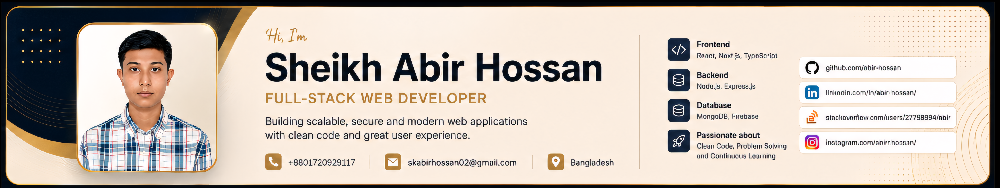

<!-- =========================================================
========================================================== -->

<h1 align="center">Hi 👋, I'm Sheikh Abir Hossan</h1>

<h3 align="center">
  Full-Stack Developer | Next.js | React | TypeScript | MERN Stack
</h3>

 

  

---

## 👨‍💻 About Me

I'm **Sheikh Abir Hossan**, a **Full-Stack Developer** focused on building modern, scalable, secure, and user-friendly web applications.

My primary stack includes **Next.js, TypeScript, React, Node.js, Express.js, MongoDB, and RESTful APIs**. I enjoy turning ideas into production-ready applications, designing maintainable architectures, building responsive interfaces, and solving practical engineering problems.

- 🔭 **Building:** Modern full-stack web applications
- 🌱 Exploring advanced **Next.js, TypeScript, and backend development**
- 🎯 Focused on writing clean, maintainable, and reusable code
- 🚀 Interested in performance, responsive design, and great user experiences
- 📍 Based in **Dhaka, Bangladesh**
- 📫 **Reach me:** `skabirhossan02@gmail.com`
- 🎯 **Goal:** Keep growing as a software engineer by building useful products

---

## 💻 Full-Stack Development

<table>
<tr>
<td width="33%" valign="top">

### 🎨 Frontend
`React.js`  
`Next.js`  
`TypeScript`  
`JavaScript`  
`HTML5`  
`CSS3`  
`Tailwind CSS`  
`Bootstrap`

</td>
<td width="33%" valign="top">

### ⚙️ Backend
`Node.js`  
`Express.js`  
`REST APIs`  
`Authentication`  
`API Integration`

</td>
<td width="33%" valign="top">

### 🗄️ Database & Services
`MongoDB`  
`Firebase`  
`Database Design`  
`CRUD Operations`  
`Data Modelling`

</td>
</tr>
</table>

---

## 🛠️ Tech Stack

### Languages

### Frontend

### Backend & Database

### Tools & Design

---

## 🚀 Featured Projects

I use this section for projects that best demonstrate **full-stack engineering, clean UI, API design, authentication, database work, performance, and maintainable architecture**.

### 🎬 Movie Explorer

A modern and responsive taxi service website focused on clean design,
accessibility, and a smooth user experience.

**Tech Stack:** React • JavaScript • Tailwind CSS

[Repository](https://github.com/Abir-Hossan/Movie-Explorer.git) • [Live Demo](https://movie-explorer-ivory-six.vercel.app/)

---

### 💼 Demo Portfolio

A responsive developer portfolio designed to showcase projects, technical
skills, experience, and professional information.

**Tech Stack:** React • TypeScript • Tailwind CSS • Express • Node.js

🔗 [Live Demo](https://demo-portfolio-omega-ruby.vercel.app/)  
📂 [Repository](https://github.com/Abir-Hossan/Demo-Portfolio.git)

---

### 🏋️ FitLog

A fitness tracking web application designed to help users monitor workouts
and fitness-related activities through a simple and intuitive interface.

**Tech Stack:** Next.js • React • TypeScript • Tailwind CSS

🔗 [Live Demo](https://fit-log-project-ecru.vercel.app/)
📂 [Repository](https://github.com/Abir-Hossan/FitLog-Project.git)

---
## 📊 GitHub Statistics

  
  

### 🔥 Contribution Streak

---

## 📅 GitHub Contributions

GitHub already provides the authoritative contribution calendar directly on the profile. Use the button below to open the live contribution history rather than depending on an unreliable third-party graph renderer.

---

## 🐍 Contribution Snake

<picture>
  <source
    media="(prefers-color-scheme: dark)"
    srcset="https://raw.githubusercontent.com/Abir-Hossan/Abir-Hossan/output/github-snake-dark.svg"
  />
  <source
    media="(prefers-color-scheme: light)"
    srcset="https://raw.githubusercontent.com/Abir-Hossan/Abir-Hossan/output/github-snake.svg"
  />
  
</picture>

---

## 🎯 Current Goals

- 🚀 Build production-ready full-stack applications
- 🧠 Improve system design, algorithms, and problem-solving skills
- 🔐 Build more secure and scalable application architectures
- 🌐 Contribute to open-source projects
- ⚡ Improve application performance and developer experience
- 💻 Become a stronger software engineer
- 📚 Keep learning and shipping

---

## 📚 Currently Learning

---

## 🤝 Connect With Me

---

## 💼 Open to Opportunities

I'm interested in opportunities and collaborations involving:

*Full-Stack Development` • `Web Development` • `Software Engineering` • `Open Source` • `Interesting Development Projects*

If you're working on something useful and think my skills could contribute, feel free to reach out.

---

## 🌟 Let's Build Something Great

**Build with purpose • Learn continuously • Solve real problems**

 <i>Thanks for visiting my profile! Feel free to explore my repositories and connect with me.</i>

**Keep Coding • Keep Learning • Keep Building 🚀**

